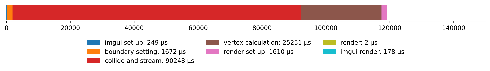

# Fluid Simulation
## Lattice Boltzmann Method ( LBM )

<p align="center">
  
  
  <br>
  
  
  <br>
  <span>top-left: curl, top-right: speed, bottom-left: ux, bottom-right: uy</span>
</p>

### Feautures

* Visualization of multiple properties including speed, density, and curl
* Cross-platform: Linux and Windows
* Rendering using OpenGL
* CPU multi-threading using TBB
* GPU acceleration using SYCL
* OpenCV colormaps
* UI using ImGui

### Building

To build the project, clone the GitHub repo to your machine:
```cpp
git clone https://github.com/nicholashanson/fluid_simulation
```
Navigate to the project directory:
```cpp
cd fluid_simulation
```
Navigate to the "main" directory:
```cpp
cd main
```
On Windows, run "set_up.ps1" in PowerShell with Administrator access:
```cpp
./set_up.ps1
```
On Linux, run "set_up.sh":
```cpp
./set_up.sh
```
This will handle the entire build process from downloading and managing dependencies to compilation and linking.
This may take a while depending on which dependencies are already present on your machine. This build makes no assumptions about what is already installed on the system, except git. After the build is complete, you can run the program:
```cpp
./fs
```
This build won't include GPU acceleration for now.

### Profiling

#### Using TBB for vertex calculation and collide-and-stream

<p align="center">
  
</p>

#### Using SYCL for vertex calculation and collide-and-stream

<p align="center">
  
</p>

* In OpenGL, the CPU offloads rendering to the GPU asynchronously, so calling "render_grid" is negligible.
* In the case where GPU-offloading is used for compute, each loop takes around 80 milliseconds to execute, which works-out to around 12 FPS and 240 steps per second ( 20 steps per loop ).
* "render setup" and "imgui render" are both taking significantly longer when GPU-offloading is used, even though these parts of the code are not directly linked to GPU-offloading. iGPU utilisation on my system is also approximately double when the dGPU is used for compute. Also GPU shared-memory usage ramps in a cycle when the dGPU isn't utililised but stays stable when it is. I need to profile the rendering process to try and get some insight into this.

