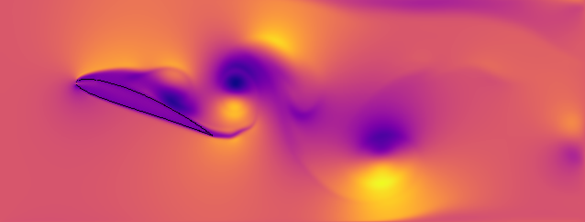
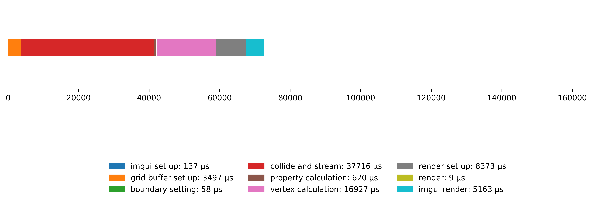
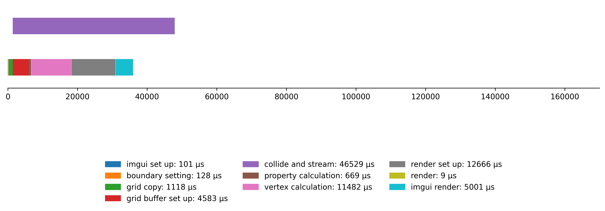

# Fluid Simulation
## Lattice Boltzmann Method ( LBM )

<p align="center">
  
  
  <br>
  
  
  <br>
  <span>top-left: density, top-right: ux, bottom-left: uy, bottom-right: curl</span>
</p>

<p align="center">
  
  
  <br>
  
  
  <br>
  <span>top-left: 3° angle-of-attack, top-right: 10° angle-of-attack, bottom-left: 15° angle-of-attack, bottom-right: 20° angle-of-attack</span>
</p>

### Feautures

* Visualization of multiple properties including speed, density, and curl
* Cross-platform: Linux and Windows
* Rendering using OpenGL
* CPU multi-threading using TBB
* GPU acceleration using SYCL
* OpenCV colormaps
* UI using ImGui

### Building

To build the project, clone the GitHub repo to your machine:
```cpp
git clone https://github.com/nicholashanson/fluid_simulation
```
Navigate to the project directory:
```cpp
cd fluid_simulation
```
Navigate to the "main" directory:
```cpp
cd main
```
On Windows, run "set_up.ps1" in PowerShell with Administrator access:
```cpp
./set_up.ps1
```
On Linux, run "set_up.sh":
```cpp
./set_up.sh
```
This will handle the entire build process from downloading and managing dependencies to compilation and linking.
This may take a while depending on which dependencies are already present on your machine. This build makes no assumptions about what is already installed on the system, except git. After the build is complete, you can run the program:
```cpp
./fs
```
This build won't include GPU acceleration for now.

### Profiling

#### Fork-join parallelism using TBB for vertex calculation and collide-and-stream

<p align="center">
  
</p>

#### Fork-join parallelism using SYCL for vertex calculation and collide-and-stream

<p align="center">
  
</p>

* In OpenGL, the CPU offloads rendering to the GPU asynchronously, so calling "render_grid" is negligible.
* In the case where GPU-offloading is used for compute, each loop takes around 80 milliseconds to execute, which works-out to around 12 FPS and 240 steps per second ( 20 steps per loop ).
* "render setup" and "imgui render" are both taking significantly longer when GPU-offloading is used, even though these parts of the code are not directly linked to GPU-offloading. iGPU utilisation on my system is also approximately double when the dGPU is used for compute. Also GPU shared-memory usage ramps in a cycle when the dGPU isn't utililised but stays stable when it is. I need to profile the rendering process to try and get some insight into this.

#### Task-level paralellism using TBB

We can use the "task_group" class in TBB to manage task-level parallelism. Vertex calculation and collide-and-stream are the compute-heavy parts of the loop. Instead of first performing collide-and-stream and then using the output to compute the vertex data, we can instead stagger the two operations: we calculate the vertex data and render the current state and at the same time calculate the next stage of the simulation:

```cpp
tbb::task_group group;

while( ... ) {

  if ( simulation_running ) {

    grid_copy = grid;

    // calculate the next stage in the simulation at the same time as ...
    group.run( [&]() {

      collide_and_stream( grid );
    });

    // ... rendering the current state before ...
    group.run( [&]() {

      vertices = calculate_vertex_data( grid_copy );

      render_grid( vertices );
    });

    // ... synchronising for the next iteration
    group.wait();
  }
}
```

To ensure there are no data-races, we copy the grid at the beginning of the loop. With modern hardware and compiler optimizations, copying contiguous memory like a vector is extremely fast ( around 1 millisecond for 128 KB ), which is tiny in comparision to the performance gains from task-level parallelization. Because vertex calculation and collide-and-stream are now concurrent, using the CPU for one task and the dGPU for the other usually ensures the best uitilisation of resources.

Here are the results for using only the CPU for both concurrent operations:

<p align="center">
  
</p>

Here are the results for using the dGPU for collide-and-stream and the CPU for vertex calculation:

<p align="center">
  
</p>

